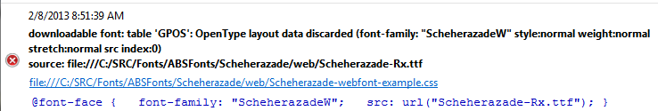
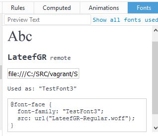

Because modern browsers support `@font-face`, you can test a font without actually installing it in your system. This is handy especially for comparing different versions of the same font and for systems, like Windows, where font install isn’t quite as reliable as one might like.

With all source documents, stylesheets, and fonts to be tested on your local computer rather than a web server, this no-install testing can provide for rapid build and test cycles.

Recent versions of Firefox, Chrome, and Edge all support this technique.

## Mozilla Firefox

### Useful configuration options

Depending on your testing needs, there are a few Firefox preferences that you may want to adjust. To make these adjustments, enter `about:config` in the address bar.

#### `gfx.font_rendering.graphite.enabled`

This setting determines whether Graphite rendering is enabled. Changing this instantly refreshes other tabs and windows.
- Data type: Boolean
- Default value: Prior to FF22: `False`;  FF22 and beyond: `True`

#### [`security.fileuri.strict_origin_policy`](http://kb.mozillazine.org/Security.fileuri.strict_origin_policy)

This setting determines whether local urls are restricted to current folder and below. When local documents (e.g., those located on your hard drive) are loaded into the browser, the scripts and links within have restrictions on what they can see and do. By default local documents have access to other local documents in the same directory and in subdirectories, but not directory listings. This means that CSS text such as:

&nbsp;&nbsp;&nbsp;&nbsp;&nbsp;&nbsp;`@font-face { font-family: Test; src: url(../myfont.ttf); }`

will not be able to load myfont.ttf. To get around this you need to set this configuration setting to `False` so that the local documents are allowed to access any file on your harddrive.

- Data type: Boolean
- Default value: `True` (all urls restricted to current folder and below).

#### `devtools.fontinspector.enabled`

This setting determines whether the Developer tool called the Inspector will tell you exactly what font is being used for a selected text element.

- Data type: Boolean
- Default value: currently `True`

### OT Sanitizer testing

Because Firefox does integrity checks on any `@font-face` fonts, you can get the benefit of checking your fonts with OT Sanitizer without having to build and install the utility. If your OpenType logic isn’t working, or maybe it isn't even your font at all, you might check the Firefox Browser Console for messages similar to this one:

which shows that OT Sanitizer didn’t like the `GPOS` table.

To view the Browser Console, press Ctl-Shift-J or click the hamburger icon then `Developer` -> `Browser Console`.

### What font is being used?
If you are not sure what font is actually being used for some text element in your document, you can find out with the Element Inspector. Ctl-Shift-C or press the hamburger icon then `Developer` -> `Inspector`. Finally, click on some text and look in the lower right corner of the Inspector for the Fonts panel:

If the font panel is not visible, see Useful Configuration Options, above.

### Oops — Font Caching!

I had a problem with a "downloaded" (@font-face) font not behaving properly in Firefox even after making sure the css identified the corrected version of the font.
As discussed in [Bug 816483](https://bugzilla.mozilla.org/show_bug.cgi?id=816483),  Firefox v20.0 and later cache downloaded fonts (for a while) to speed up display of websites (e.g., newspapers) that use the same webfonts on lots of pages. Unfortunately, when this font caching was first introduced, there was no way to force Firefox to reload the font in case, for example, you had just built a new version. Starting with Firefox v24.0, cached webfonts are reloaded when the user performs a "shift" reload (hold shift key and press Reload, or for Windows users, ctl-F5).

### Graphite and OT feature testing

With appropriate CSS, OpenType Stylistic Sets and Character Variants and Graphite features can all be tested with Firefox.

## Google Chrome

### Permitting local stylesheet

By default Chrome does not allow access to certain types of *local* files -- even if the page you are displaying is a local file and the referenced file is in the same folder. Thus, when rendering a local document that references a local XSL stylesheet, Chrome will not load the stylesheet and thus your document will appear as a blank page.

To override this behaviour you have to start Chrome with a particular command line option. To do this:

* You must first stop *all* Chrome processes. This includes:
    * Close all Chrome windows
    * Close any site-specific Chrome browser (a.k.a. Chrome shortcut) windows
    * Stop any Chrome background tasks. NB: newer versions of Chrome default to keeping a background task running even after you have closed all Chrome windows. To change this, go to Chrome Settings then, in the System section, disable "Continue running background apps when Google Chrome is closed."
* Launch Chrome with the `--allow-file-access-from-files` option.  For Windows you can set up a Windows shortcut to Chrome using:
    * Target: `"C:\Program Files (x86)\Google\Chrome\Application\chrome.exe" --allow-file-access-from-files`
    * Start in: `"C:\Program Files (x86)\Google\Chrome\Application"`

### Graphite and OT feature testing

Stylistic sets, Character Variants, and other OpenType features can all be tested with appropriate CSS.

As of Version 57.0.2987.110, Chrome does not support Graphite rendering

## Microsoft Edge

We've recently become aware that Microsoft Edge can also be used for font testing as it now supports OpenType Stylistic Sets and Character Variant features. It does not support Graphite rendering.
