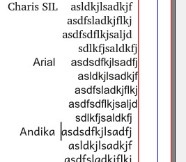
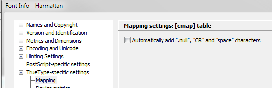
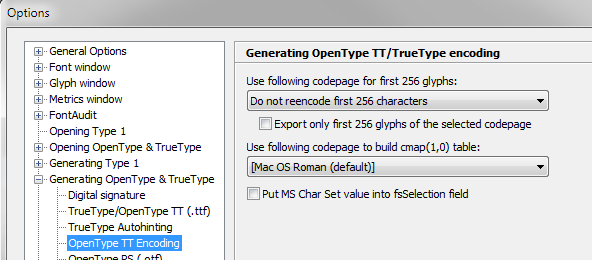

# Recommendation

**We recommend that fonts not encode in the cmap characters below U+0020 SPACE.**

# Background

The OS/2 table contains a field known as `usFirstCharIndex` which, according to the [OpenType specification][OTSpec], is:

>The minimum Unicode index (character code) in this font, according to the cmap subtable for platform ID 3 and platform- specific encoding ID 0 or 1. For most fonts supporting Win-ANSI or other character sets, this value would be 0x0020. This field cannot represent supplementary character values (codepoints greater than 0xFFFF). Fonts that support supplementary characters should set the value in this field to 0xFFFF if the minimum index value is a supplementary character.

which suggests that the norm is for Unicode cmaps to start encoding at U+0020.

Historically, however, a number of vendors (most commonly Adobe and SIL) have released fonts with characters below U+0020 (space) encoded in the cmap, resulting in the `usFirstCharIndex` value being less than 0x0020.

# Why is this a problem?

`usFirstCharIndex` values lower than 0x0020 can confuse software and cause unexpected results.

One example is Scribus which, as of the May 2014, actually draws the glyph for CR (and possibly LF) if they are encoded. If the CR/LF glyphs have width (as CR does in many fonts), they will impact right-aligned text, as in this example:  



# Solutions

The exact procedures needed to make sure your font does not encode characters below U+0020 will depend on the toolchain you use.

## Fontlab

For Fontlab Studio, follow these steps:

1. Make sure none of .null, CR/nonmarkingreturn or tab (or anything else down there before the space glyph) have USVs in their glyph properties.

1. Set FontInfo to not add .null, CR and space:


1. Finally make sure in the TrueType generation options that the first 256 chars are not being re-encoded:



## VOLT

If the project uses Microsoft VOLT then the VOLT project (`.vtp` file) may be overriding the encoding of these first few glyphs, e.g.,:

```
DEF_GLYPH ".notdef" ID 0 TYPE BASE END_GLYPH
DEF_GLYPH ".null" ID 1 UNICODE 0 TYPE BASE END_GLYPH
DEF_GLYPH "nonmarkingreturn" ID 2 UNICODE 13 TYPE BASE END_GLYPH
DEF_GLYPH "space" ID 3 UNICODE 32 TYPE BASE END_GLYPH
DEF_GLYPH "tab" ID 4 UNICODE 9 END_GLYPH
```

These can be cleaned up within VOLT by using the Glyph Editor or by exporting the project to a text file, editing to remove the `UNICODE nn` reference, and re-importing the project.

[OTSpec]: https://www.microsoft.com/typography/otspec/os2.htm#fci
