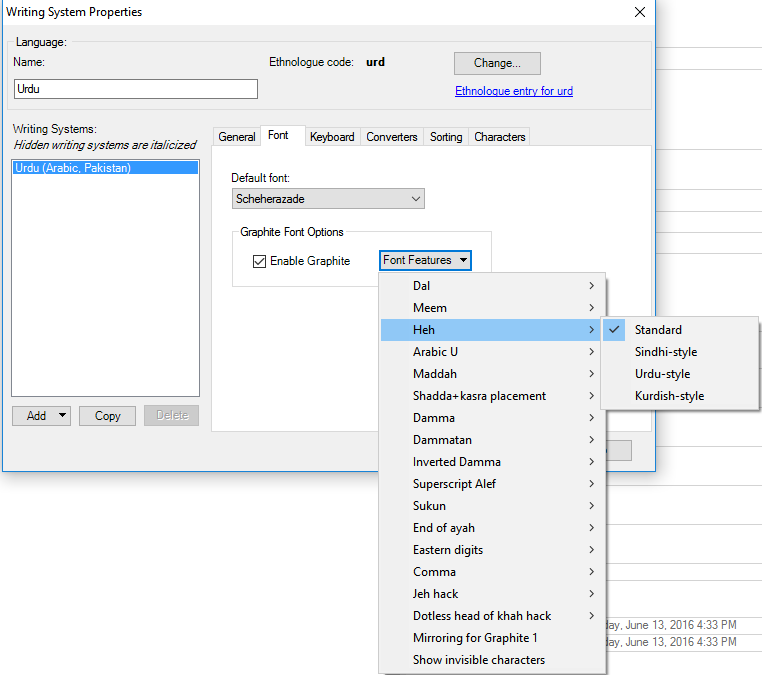

## Summary of Recommendations
**We recommend that fonts include UI strings for all `ssxx` and `cvxx` OpenType features within their fonts. For `cvxx` features that have more than two possible values, fonts should include UI strings for the values as well as the feature itself.**

**For fonts that include both Graphite and OpenType logic, we recommend that both technologies use the same UI strings for corresponding features.**

## What are UI strings?

Generically speaking, font features can be considered in two broad categories:
- features required by a specific script, such as Arabic initial, medial, and final forms.
- optional behavior that the user can enable or disable, such as small caps or lining numerals.

The second category (optional behavior) further subdivides into:
- features whose behavior is defined by standards such as the OpenType specification, for example the *Discretionary Ligatures* (`dlig`) and *Petite Capitals From Capitals* (`c2pc`) features.
- features whose behavior is defined entirely by the logic within the font. For Graphite this would be all features; for OpenType it would mean only the *Stylistic Set* (`ssxx`) and *Character Variant* (`cvxx`) features.

If an application wants to provide a user interface for these optional behaviors, it needs human-readable (and preferably localizable) text giving the name of each feature and, in many cases, the names of the various values that feature can take on. We call this human-readable text data _User Interface Strings_, or **UI strings** for short.

For behaviors defined by a standard such as OpenType, suitable text for UI strings can easily obtained from the standard itself.

But what to do for that last category &mdash; features whose behavior is defined entirely by logic within the font? The answer is that the _font itself must provide the text_. The font vendor should, therefore, ensure that their fonts contain all needed UI strings.

### Coordinating OpenType and Graphite

For fonts that contain both Graphite and OpenType logic, it is usually the case that many of the features are have the same purpose and result in both technologies. For such features it is best practice if the human readable strings are the same for corresponding Graphite and OpenType features. So for example, don’t call the feature *Literacy Alternates* in Graphite and *Literacy alternates* in OpenType.

Not only does using the same UI strings make sense from the point of view of the user experience, it also makes the font smaller since one copy of each UI string can be shared by both Graphite and OpenType.

## Graphite
Adding UI strings for Graphite fonts is easy since the Graphite Description Language (GDL) used to create Graphite fonts includes the UI strings within the Feature Table, for example:
```
eng {
	id = "Engs";
	name.1033 = string("Uppercase Eng alternates");
	default = descender;
	settings {
		descender {
			value = 0;
			name.1033 = string("Large eng with descender");
		}
		base {
			value = 1;
			name.1033 = string("Large eng on baseline");
		}
		short {
			value = 3;
			name.1033 = string("Large eng with short stem");
		}
		capital {
			value = 2;
			name.1033 = string("Capital N with tail");
		}
	}
}
```

Graphite UI strings can be localized by including translations for desired languages.

For further information see the description of the _Feature Table_ in the [GDL manual][GDL].

## OpenType

For OpenType, the only two features that need UI strings are the [Stylistic Sets][SSXX] (`ss01`, `sso2`, ... `ss20`) and [Character Variants][CVXX] (`cv01`, `cv02`, ... `cv99`).

### Differences between `ssnn` and `cvnn` features

It is important to keep in mind fundamental differences between Stylist Sets and Character Variants:

* Stylistic Sets are, by definition, binary features &mdash; a given Stylistic Set is either on or off.

* Character Variants can be binary, but they can also be defined with more than two possible values.

Similarly, the UI strings that can be provided for Stylist Sets are different than that for Character Variants:

* The only UI string that can be provided for ssnn features is:
  * The name of the feature; there is no way to provide names for the values.
* The UI strings that can be provided for cvnn features include:
  * The name of the feature itself, e.g., *Rams horn alternates*
  * The names of the various values, e.g. *Small bowl, Large bowl* and *Small gamma*.


One implication of the above is that when Stylistic Set features are used, their UI string should have an obvious yes/no meaning. For example, *Barred bowl forms* and *Vietnamese-style diacritics* are good names &mdash; the user can predict what turning on this feature is going to do &mdash; whereas *alternate noon* might not be such a good name.   

### How to add UI Strings to OpenType

For OpenType, we’d like to be able to define the UI strings via the FEA source files. The Adobe FDK documentation defines the syntax and provides examples for both [Descriptive names for Stylistic Set ('ss01 - ss20') features][FDKSSXX] and [UI Label names for Character Variant 'cv01 - cv99') features][FDKCVXX].

Unfortunately, as of this writing, not all FEA compilers support the full syntax. In particular, Google's FontTools supports Stylist Sets but not Character Variants (see [Issue #860][FTCVXXBUG].) And even if they did, neither the Graphite compiler nor existing FEA compilers are clever enough to re-use UI strings added to the font by the other, which means fonts that include both Graphite and OpenType logic will have two sets of UI Strings, bloating the font size.

Therefore, at present we are recommending the `ttffeatparms` utility from [FontUtils][FONTUTILS]. To get help with this utility, at the command line type:

```
ttffeatparms -h
```
OpenType UI strings are coded in an xml control file. Here is a simple example that covers one Stylist Set and one Character Variant feature, with UI strings just in English:
```
<?xml version="1.0" encoding="UTF-8"?>
  <featureparams>
    <sset feat="ss02">
      <name><nstring lang="en">UI string for SS02</nstring></name>
    </sset>
    <cvar feat="cv01">
      <name><nstring>Jha alternates</nstring></name>
      <npstring lang="en">First named param for cv01</npstring>
      <npstring lang="en">Second named param for cv01</npstring>
      <npstring lang="en">Third named param for cv01</npstring>
    </cvar>
  </featureparams>
```
Here is the same example with some French localization added:
```
<?xml version="1.0" encoding="UTF-8"?>
  <featureparams>
    <sset feat="ss02">
      <name>
        <nstring lang="en">UI string for SS02</nstring>
        <nstring lang="fr">nom de ss02</nstring>
      </name>
    </sset>
    <cvar feat="cv01">
      <name><nstring>Jha alternates</nstring></name>
      <npstring lang="en">First named param for cv01</npstring>
      <npstring lang="en">Second named param for cv01</npstring>
      <npstring lang="en">Third named param for cv01</npstring>
      <npstring lang="fr">Premier paramètre nommé pour cv01</npstring>
      <npstring lang="fr">Deuxième paramètre nommé pour cv01</npstring>
      <npstring lang="fr">Troisième paramètre nommé pour cv01</npstring>
    </cvar>
  </featureparams>
```

## Beyond feature and value names

While feature name and value strings are the minimum we should be providing, OpenType Character Variant features can provide additional data that may be useful within a UI:

* *Tool tip: *a string  that an application can use as a tool tip in the UI

* *Sample Text*: a string that illustrates the effect of the feature

* *USV list*: not a string, but rather a list of Unicode Scalar Value of the characters for which this feature provides glyph variants. (NB: This is not an array of strings, therefore features which affect character sequences can’t really be represented by this entry).

The XML control file provided as input to `ttffeatparms` can provide all of this additional information, but at the present time we are unaware of any application that can use any of it. Therefore we consider this extra data to be optional and low priority.

## Adding OpenType UI strings into a font

The desired sequence is as follows:

* Compile OpenType (and, if used, Graphite) features into the font before adding OpenType UI strings

* Add OpenType UI strings into the font. The basic command to do this looks as follows:

```
tffeatparms -c control.xml input.ttf output.ttf
```

## Application support

Support for UI strings is a chicken-and-egg problem: not many fonts have the UI strings, so not many application vendors are motivated to add support, and since not many applications have support, few font vendors are motivated to add the strings.

Because UI strings have always been part of Graphite, some Graphite-enabled apps populate their UI with Graphite features. Here is an example screenshot from SIL FieldWorks suite showing that UI:



As of this writing, the only applications we know about that supports UI strings for OpenType are some of Adobe's Creative Cloud suite (such as InDesign), but even those support only UI strings for Stylistic Sets. Most SIL fonts include UI strings, and SIL applications are planning to add support.

Please let us know if you become aware of other applications that support UI strings so we can include them here.

[GDL]:https://github.com/silnrsi/grcompiler/blob/master/doc/GDL.pdf
[CVXX]:https://www.microsoft.com/typography/otspec/features_ae.htm#cv01-cv99
[SSXX]:https://www.microsoft.com/typography/otspec/features_pt.htm#ssxx
[FDKSSXX]:https://rawgit.com/adobe-type-tools/afdko/master/afdko/Technical%20Documentation/OpenTypeFeatureFileSpecification.html#8.c
[FDKCVXX]:https://rawgit.com/adobe-type-tools/afdko/master/afdko/Technical%20Documentation/OpenTypeFeatureFileSpecification.html#8.d
[FTCVXXBUG]:https://github.com/fonttools/fonttools/issues/860
[FONTUTILS]:http://scripts.sil.org/cms/scripts/page.php?site_id=nrsi&id=fontutils
